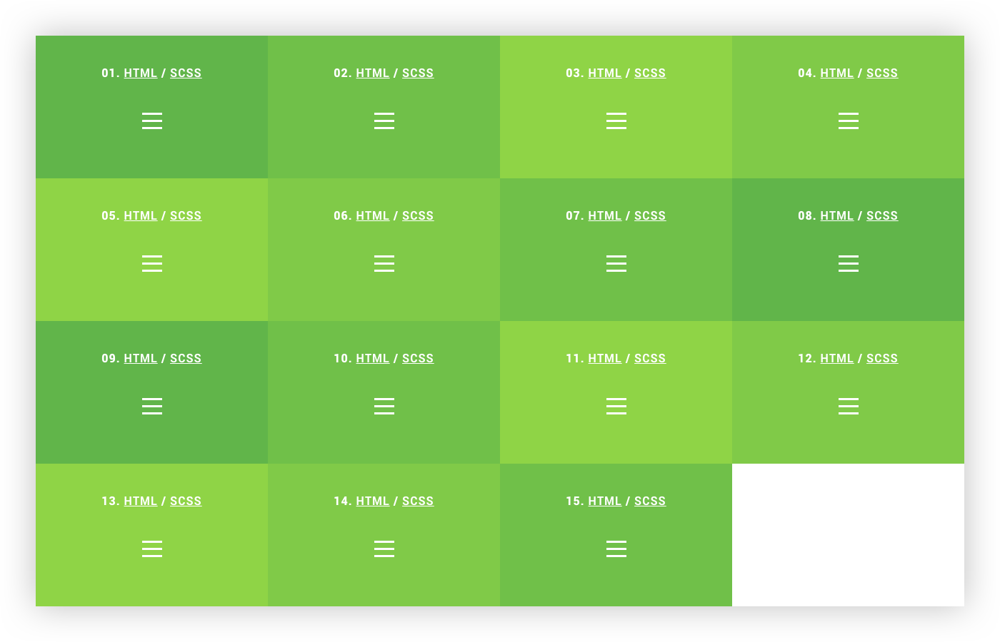

# Animated hamburger icons

Hamburger icons with CSS-driven transitions. Created to be as performant, elegant and widely supported as possible. This means no JavaScript animations, SVG's or transitions on non-cheap properties.

## Usage

Visit [animated-hamburger-icons.netlify.com](https://animated-hamburger-icons.netlify.com), pick a hamburger and grab the HTML + SCSS. The only thing left is adding the `animate` class when clicking the hamburger.

## Support

The basic functionality will work on all browsers supporting the `transform` property ([caniuse reference](http://caniuse.com/#feat=transforms2d)). Animations will work on all browsers supporting the `transition` property ([caniuse reference](http://caniuse.com/#feat=css-transitions)).
